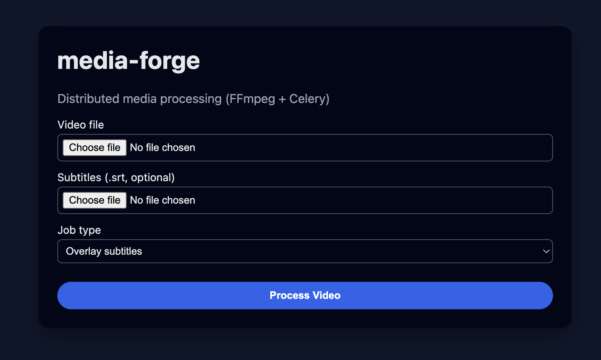

# media-forge


Distributed media processing engine built with **FastAPI**, **Celery**, **Redis**, and **FFmpeg**, runnable locally with **Docker Compose** (including Colima environments).

The system exposes a simple HTTP API and minimal web UI for uploading videos and running asynchronous processing jobs:

- **overlay**: burn `.srt` subtitles into a video
- **transcode**: downscale video to 480p (854x480)
- **extract**: extract audio track as MP3

Workers pull jobs from a Redis-backed Celery queue and write outputs to shared storage mounted at `/data`.

---

## Quickstart

### Prerequisites

- Docker (Colima-compatible)
- Docker Compose (`docker compose` plugin)

If you are using **Colima**:

```bash
colima start --cpu 4 --memory 8 --disk 20
```

### Run the stack

From the `media-forge/` directory:

```bash
docker compose up --build
```

This will start:

- `redis`: Celery broker and result backend
- `api`: FastAPI application with static frontend on port `8000`
- `worker`: Celery worker process

Visit:

- UI: http://localhost:8000/
- Health: http://localhost:8000/health

To scale workers horizontally:

```bash
docker compose up --build --scale worker=4
```

All workers share the same `/data` volume, enabling distributed processing.

---

## API Overview

### 1. Submit Job

`POST /jobs`

Multipart form fields:

- `video`: video file (required)
- `subtitles`: `.srt` subtitles file (optional, but **required** when `job_type=overlay`)
- `job_type`: one of: `overlay`, `transcode`, `extract`

Example:

```bash
curl -X POST "http://localhost:8000/jobs" \
  -F "job_type=transcode" \
  -F "video=@sample-data/rotating_earth.mp4"
```

Overlay with subtitles:

```bash
curl -X POST "http://localhost:8000/jobs" \
  -F "job_type=overlay" \
  -F "video=@sample-data/rotating_earth.mp4" \
  -F "subtitles=@sample-data/earth_rotation_30s.srt"
```

Extract audio:

```bash
curl -X POST "http://localhost:8000/jobs" \
  -F "job_type=extract" \
  -F "video=@sample-data/rotating_earth.mp4"
```

Response:

```json
{
  "job_id": "<celery-task-id>",
  "status": "pending",
  "output_url": null,
  "error": null
}
```

### 2. Check Job Status

`GET /jobs/{job_id}`

Example:

```bash
curl "http://localhost:8000/jobs/<job_id>"
```

Response:

```json
{
  "job_id": "<job_id>",
  "status": "processing",   // one of: pending, processing, completed, failed
  "output_url": null,        // set when completed
  "error": null              // populated on failures
}
```

### 3. Download Processed File

`GET /jobs/{job_id}/download?job_type={job_type}`

The `job_type` query parameter is required so the API can derive the deterministic output path.

Example (matching initial job type):

```bash
curl -L "http://localhost:8000/jobs/<job_id>/download?job_type=transcode" \
  -o output-480p.mp4
```

Overlay download:

```bash
curl -L "http://localhost:8000/jobs/<job_id>/download?job_type=overlay" \
  -o output-overlay.mp4
```

Extracted audio download:

```bash
curl -L "http://localhost:8000/jobs/<job_id>/download?job_type=extract" \
  -o output-audio.mp3
```

---

## Minimal Frontend

The FastAPI app serves a small HTML/JS frontend from `/`:

- Choose video
- Optional `.srt` subtitles
- Select job type (overlay / transcode / extract)
- Click **Process Video**
- UI shows `job_id` and current status, polling every 3 seconds
- When done, a **Download Result** button appears

This frontend is implemented in plain HTML + CSS + vanilla JS in `frontend/`.

---

## Architecture Summary

High-level data flow:

```text
Client → FastAPI API → Redis (Celery broker) → Celery Workers → /data volume
```

Key components:

- **FastAPI API (backend/app/main.py)**
  - Routes defined in `backend/app/api/routes_jobs.py`
  - Accepts file uploads and job type
  - Persists uploads to `/data/input`
  - Enqueues Celery tasks with job metadata
  - Exposes job status and download endpoints

- **Celery Workers (backend/app/workers/tasks.py)**
  - Generic `process_media_task` that can run overlay, transcode, or extract
  - Uses `backend/app/workers/ffmpeg_service.py` to build and run FFmpeg commands
  - Reads inputs from `/data/input`, writes results to `/data/output`
  - Uses deterministic output names per job (`{job_id}_{job_type}.mp4` or `.mp3`)
  - Idempotent & retryable with exponential backoff using Celery’s autoretry

- **Redis**
  - Celery broker & result backend (separate DBs configured for clarity)
  - Stores queued jobs and completion states

- **Shared Storage**
  - Docker named volume `media_data` mounted as `/data`
  - Layout:
    - `/data/input` – original uploads
    - `/data/output` – processed files
    - `/data/temp` – scratch space (not heavily used in this demo)

More details on internals are documented in **DESIGN.md**.

---

## Observability & Production Hardening

In this demo, observability is limited to logging. For a production-ready deployment you could integrate:

### Metrics with Prometheus

- Export FastAPI metrics (request counts, latencies) using middleware or libraries like `prometheus-fastapi-instrumentator`.
- Export Celery metrics:
  - Task throughput per job type
  - Task latency (queue time + processing time)
  - Retry counts and failure rates
  - Queue depth (number of pending tasks)

Expose these metrics via HTTP endpoints scraped by Prometheus.

### Dashboards with Grafana

Grafana can visualize:

- **Worker health**: up/down status, heartbeat time, concurrency
- **Job latency**: histograms of end-to-end job duration and processing time
- **Queue backlog**: number of queued jobs per job type
- **Stuck job detection**:
  - High number of tasks in `STARTED` state beyond a threshold
  - Tasks exceeding expected processing duration

Alerting rules could notify operators when:

- Queue depth exceeds a threshold (autoscale workers)
- Failure/timeout rate spikes for a given job type

### Structured Logging & Tracing

- Use JSON logs with correlation IDs (e.g., `job_id` / Celery task ID) for easier tracing across services.
- Integrate with OpenTelemetry for distributed tracing across API and workers.

---

## Scaling Strategy: 10 jobs/hour → 10,000 jobs/hour

This project is intentionally small, but the architecture is designed to evolve.

### 1. Horizontal Worker Autoscaling

- **Today**: scale manually via

  ```bash
  docker compose up --scale worker=4
  ```

- **At scale** (Kubernetes):
  - Deploy workers as a `Deployment`
  - Use Horizontal Pod Autoscaler (HPA) to scale based on:
    - Queue length (via custom metrics)
    - CPU utilization of worker pods
  - Configure max concurrency per worker pod based on CPU/IO profile

### 2. Distributed Object Storage

Local volumes do not scale to many nodes or regions. For 10k+ jobs/hour:

- Move from `/data` volume to object storage such as **S3**, **GCS**, or **MinIO**.
- API writes uploads directly to a bucket (e.g., `s3://media-input/...`).
- Workers read from buckets and write output back to buckets.
- API’s download endpoint becomes a proxy or pre-signed URL generator.

This removes filesystem coupling and enables:

- Multi-AZ, multi-region deployments
- Stateless workers that can be scheduled anywhere

### 3. Sharded / Tiered Queues

As volumes increase and workloads diversify:

- Use multiple Celery queues by job type or priority:
  - `overlay`, `transcode`, `extract`, `high-priority`, etc.
- Run specialized worker pools subscribed to particular queues.
- For very high throughput, consider sharding Redis or moving to a more scalable broker (e.g., RabbitMQ, Kafka + custom worker harness).

### 4. Kubernetes Deployment

In Kubernetes:

- API as a `Deployment` + `Service` + Ingress
- Worker `Deployment` (one or more per job class)
- Redis as a managed service or stateful set, or replaced with a managed queue/broker
- Config via ConfigMaps/Secrets mapped to environment variables (compatible with current Pydantic settings)

This allows rolling upgrades, autoscaling, resource quotas, and better isolation.

---

## Agentic / Natural Language Workflows

Although this project exposes a simple job API, the underlying architecture can support **natural language-defined workflows** using LLMs and workflow engines.

Example natural language request:

> "trim this video from 10-30s and burn subtitles"

### 1. Parse Instructions with an LLM

- Use an LLM (e.g., OpenAI GPT) to parse the natural language instruction into a structured DSL or JSON spec, for example:

```json
{
  "operations": [
    {"type": "trim", "start": 10, "end": 30},
    {"type": "overlay", "subtitles": "subtitles.srt"}
  ]
}
```

### 2. Convert to a DAG of Operations

- Map each operation to one or more Celery tasks:
  - `trim` → FFmpeg command to cut the segment
  - `overlay` → existing overlay task
- Chain or group tasks using Celery primitives:
  - `celery.chain(trim_task.s(...), overlay_task.s(...))`
  - `celery.group(...)` for parallel branches

### 3. Orchestrate with Temporal (optional)

For complex, long-running workflows:

- Use **Temporal** to orchestrate multi-step media pipelines, integrating Celery tasks (or re-implementing workers as Temporal Activities).
- Temporal handles retries, timeouts, compensation, and visibility for the entire workflow.

### 4. API Layer for Natural Language Jobs

- Expose an endpoint like `POST /nl-jobs` with a JSON payload:
  - `{ "instruction": "trim this video ..." }`
  - plus file uploads or references to stored media
- Implementation:
  1. Call LLM to parse `instruction`.
  2. Translate to a DAG (Celery chain/group) or Temporal workflow.
  3. Store workflow ID as the `job_id` and surface progress via status API.

This design builds directly on the existing queue-based worker infrastructure, reusing the same FFmpeg primitives.

---

## Development Notes

- To run just the API locally (without Docker):

  ```bash
  pip install -r requirements.txt
  export REDIS_URL=redis://localhost:6379/0
  export CELERY_BROKER_URL=redis://localhost:6379/0
  export CELERY_RESULT_BACKEND=redis://localhost:6379/1
  export DATA_DIR=/tmp/media-forge-data

  uvicorn backend.app.main:app --reload
  ```

- Start a worker locally:

  ```bash
  celery -A backend.app.core.celery_app.celery_app worker -l info
  ```

Ensure Redis and FFmpeg are installed on your system for non-Docker runs.

---

## License

This project is provided as a reference implementation and demo for distributed media processing architectures.
